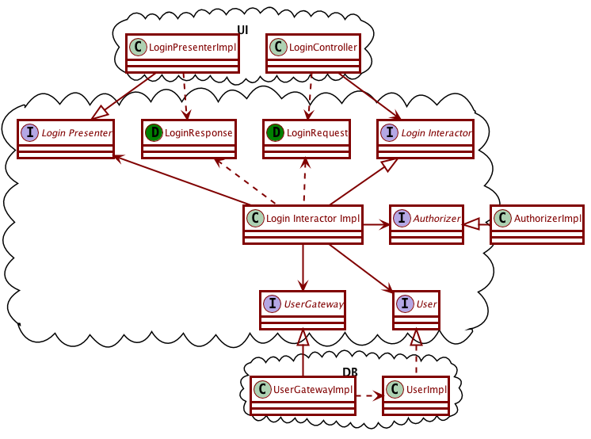

# Activity 10-4: The Login-Interactor code

We will spend some time looking at the testing for the Login Interactor. Recall the diagram describing the structure of the Login Interactor.

## Load the code in IntelliJ

1. Go to our Moodle class page, and download the **Login Interactor** zip file.
2. Extract the contents of the zip file into the directory where you save your CS321 projects. The zip file contains a `LoginInteractor` folder in it, so you don't need to create any special folders.
3. Start IntelliJ, and use the "Open" option to open the folder `LoginInteractor` that you just extracted. It is recognized as a project already because of the `.iml` file contained in it, so we do NOT want to use the "New -> ..." menu for it.
4. You should be seeing a blue ribbon near the top, with a "setup SDK" menu on its right. Click it to select an SDK, then click OK.
5. The `LoginInteractorTest` files should already be open. Use the "Add JUnit 4 to classpath" intention on any of the red "junit" references in the imports section of the test.
6. There are some remaining items that are still red. This is because we need to load a library. In order to do so, follow these steps:
    - Open the "File -> Project Structure" menu, and make sure you are in the Modules section.
    - Near the bottom of the window, use the "plus" button then choose "Library" and then "From maven", then enter the  following in the search box: `junit-hierarchicalcontextrunner`
    - Click the magnifying glass on the right to start a search, and wait for the results to show.
    - Select the 4.12.2 version, should be the first option that shows up.
    - Click OK until you are back on the Project Structure Window. You should now be seeing a new "Hierarchical context runner" item in the dependencies list. Set the "Scope" option for this new item to "Test".
    - Click OK to get back to the test code.
    - Place your cursor on the `HierarchicalContextRunner` in the `@RunWith` section, and use the "Import Class" intention. Then remove the unnecessary grayed-out import statement.
7. Use the "Projects" button on the left side to bring out the Project tree, then navigate to the `test` folder, and right-click it to "Run all tests", make sure your tests pass.

## Questions to answer

Remember that you can use "ctrl-B" to go back and forth between the definition of a symbol and its uses. It can be a convenient way to navigate the code.

1. Look at the `Authorizer` interface.
    - What are all the classes that implement the `Authorizer` interface?
    - Which of them are test doubles and what kinds of test doubles are they? Don't rely on their name alone, look at what they do.
    - Are any of these classes abstract? Then make sure you look at *their* subclasses as well.
    - Which tests are using these classes? Does it make sense, based on what those tests are trying to do?
2. In what ways does the `UserStub` class differ from its superclass, `User`? Does this match what you would expect a "stub" to do?
3. How do the `GatewayStub` and the `GatewaySpy` differ from each other?
4. In order for the `normalLogin` test method to run, which setup methods will end up running first? Keep in mind this is using the hierarchical context runner.
5. The `LoginInteractorImpl` class needs to keep track of the number of failed attempts for each username. What structure does it use to do that? Which lines of code manage this structure (create, add elements, check elements)?
6. There are some things wrong with the `countInvalidLoginAttempts` method (not mistakes, but bad code smells). Can you spot them? What suggestions would you have about fixing them?
7. Consider the `login` method. Are there any refactorings you would suggest? Try to perform them.
8. The `login` method uses a local variable `request`. Can we turn this variable into a field?
9. There is one statement/line of code in `login` that is not being tested by the tests.
    - Try to comment out one statement at a time, and take a look at the failing tests. Make sure you look at the actual tests and what they do, and understand how the tests correctly check what is going on at that line.
    - Which line is the one not picked up by the tests? How would you modify the tests so that they pick that line up? Add the corresponding part(s) to the test and confirm that now the tests would fail without that line.
