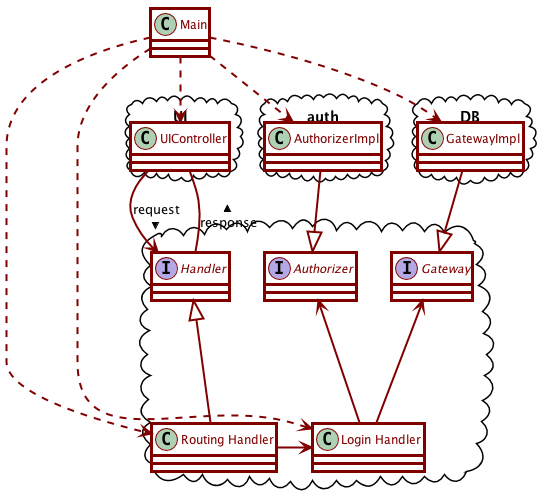

# Activity 11-1 Integration and Acceptance Tests

Integration tests and acceptance tests are closely related.

- **Integration Tests** test how the different components of the program work together. They are in essence end-to-end tests, that test the application in conditions extremely similar to its deployment, only abstracting away the UI and possibly the database.
- **Acceptance Tests** are tests which, when they pass, confirm that the required feature is fully implemented. They are in effect your "contract" with the client. They are invariably integration tests themselves, but they have this more specific goal, and they are typically written in a language that the client can understand.

We will mostly concern ourselves with integration tests for now.

## Integration Tests for a login interactor

For an integration test we must also consider the overall structure of our system. Let's start by considering the external components of our application, which we want to separate behind **boundaries**:

- There is some web server or something similar as a *delivery mechanism*, which needs to forward *requests* to our application and receive *responses* in return. We are going to need two *data-structures* (data-transfer-objects) **Request** and **Response** to represent those.
- We will also need some kind of **Handler** interface, which the delivery mechanism interacts with. It would need to have at least a method with signature `Response handle(Request req)` to handle the requests coming from the delivery mechanism. It would probably also be nice for it to have a `boolean canHandle(Request req)` mechanism to determine if it can handle a certain request.
- We will probably have many different handlers for different kinds of requests, and there is probably a main **RoutingHandler** which is the one visible to the delivery mechanism, and simply redirects traffic to the appropriate specific handler (like a login interactor).
- We will need some **Main** class to prepare this routing handler with all the other handlers that it can route requests to. We often call this the **Context**, but we'll just call it Main for now.
- There is likely some authorizing and authenticating service, represented by some **Authorizer** class, which also needs to be a plugin to our main application. We'll need to be setting it up in the Main context.
- We'll need to have some **Gateway** interface which forms our connection to a storage mechanism like a database. Again Main will be responsible for setting that up.



Our integration test will effectively take the place of the UI:

- It will set up the context to use a simple authorizing service. This will force us to do two things:
    - In the test set up method, set the authorizing service for Main. Which will force us to create a Main class.
    - Get the main handler from Main, though some sort of `getHandler` method. in particular, create some Handler interface.
- It will in effect take the place of the UI, sending requests to the router and examining the replies. This will force us to:
    - Define Request and Response data structures, each of them containing some kind of enum to represent the type of the request or response.
    - Add a `handle` method to the Handle interface.

And all of this just to get this code to compile. *Thinking of the integration test forces you to consider the overall structure of your application.*

Our `LoginRespectsAuthorization` integration test might look like this:
```java
public class LoginRespectsAuthorization {
  @Before
  public void setUp() {
    Main.setAuthorizer(SimpleAuthorizer.withEntry(USERNAME, PASSWORD));
    handler = Main.getHandler();
  }

  @Test
  public void whenUsingIncorrectCredentials_receiveErrorMessage() {
    assertIsNotAuthorized(Request.login(USERNAME, WRONG_PASSWORD));
    assertIsNotAuthorized(Request.login(WRONG_USERNAME, PASSWORD));
  }

  @Test
  public void whenUsingCorrectCredentials_becomeAuthorized() {
    assertIsAuthorized(Request.login(USERNAME, PASSWORD));
  }

  private void assertIsAuthorized(Request request) {
    Response response = handler.handle(request);
    assertEquals(AUTHORIZED, response.getType());
  }

  private void assertIsNotAuthorized(Request request) {
    Response response = handler.handle(request);
    assertEquals(UNAUTHORIZED, response.getType());
  }
}
```

### Working from the inputs to the outputs

One important principle when using integration tests to drive your code production is to work from the inputs towards the outputs. In our case, our input will be a "Login Request". As we work through the steps of converting that request into a response, a number of new classes will emerge. Here's what our TODO list would be like (most of these are going to be unit tests):

- We'll need to create a simple authorizer that authorizes username-password pairs. For now it simply needs to take a single username-password pair and remember it.
- Our Main context must be providing the routing handler via its `getHandler` method.  We'll need to at least create a RoutingHandler class to return.
- The routing handler receives the request in its `handle` method, and it must direct that request to a suitable other handler that knows how to handle it. This will be a unit test for  the Routing Handler class, and we can use a spy handler as the handler than can handle login requests.
- We will then need a LoginHandler class that says that it can handle login requests. This will be a first unit test for the `LoginHandler` class.
- Upon receiving such a request, the LoginHandler class will need to consult an Authorizer. We would need an Authorizer spy to make sure that the class passed the correct username and password to the authorizer. We will also need to decide on what the authorizer gives back as a result. For now we envision it returns some UserID-interface value with an `isValid` method, and it can be either a `ValidUserID(username)` or an `InvalidUserID`.
- We'll need to make sure that the LoginHandler sends an "authorized" response back to its caller if it received a positive response from the authorizer.
- We'll need to make sure that the LoginHandler sends an "unauthorized" response back to its caller if it received a negative response from the authorizer.
- We'll also need to make sure that our Main is correctly hooking the login handler up with the routing handler and the authorizer.

