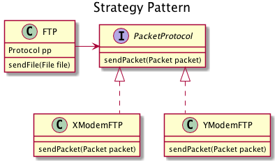
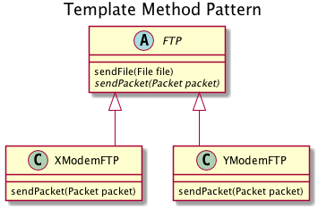

```java
// Many different implementations of it exist
interface PacketProtocol {
	void sendPacket(Packet pp);
}

class FTP {
	PacketProtocol pp;

	public FTP(PacketProtocol pp) { this.pp = pp; }

	public void setPacketProtocol(PacketProtocol pp) { this.pp = pp; }

	public void sendFile(File file) {
		List<Packet> packets = breakFileInPackets(File file);
		for (Packet packet : packets) {
			pp.sendPacket(packet);
		}
	}
}
```



```java
abstract class FTP {
	public void sendFile(File file) {
		List<Packet> packets = breakFileInPackets(File file);
		for (Packet packet : packets) {
			sendPacket(packet);
		}
	}
	public abstract void sendPacket(Packet packet);
}

class XModemFTP extends FTP {
	public void sendPacket(Packet packet) {
		...
	}
}
```
