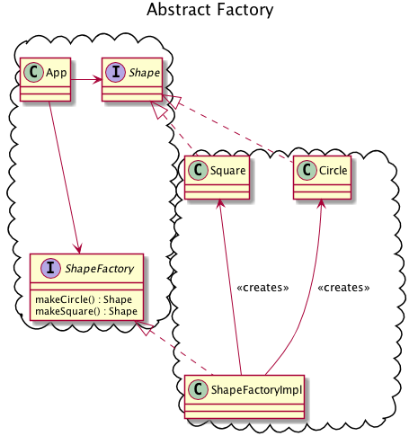
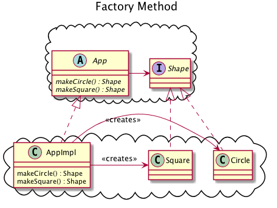

# Activity 14-1 Factory Patterns

Factory patterns concern themselves with object creation.

## abstract factory

- 11:50-15:10 factory patterns: What problem they solve

- 16:20-19:50 the abstract factory solution

Using one make method.

- 24:30-36:50 the boundary dilemma
    - 32:10-33:00 type safety relies upon coupling, and cannot be used across architectural boundaries.
    - 33:00-36:50 type safety vs independent developability

- 47:26-47:50 Test-driven development protects you from the small amount of type safety lost by using one method with string parameter.

## Variations: Factory Method

- 47:50-50:30 Pattern variations: The factory method
- 50:30-51:30 factory method vs abstract factory tradeoffs

## The problem of initialization

- 57:00-60:00 the problem of initialization
- 60:00-61:30 rant about XML
- 61:30-64:10 conclusion (rant continues)
