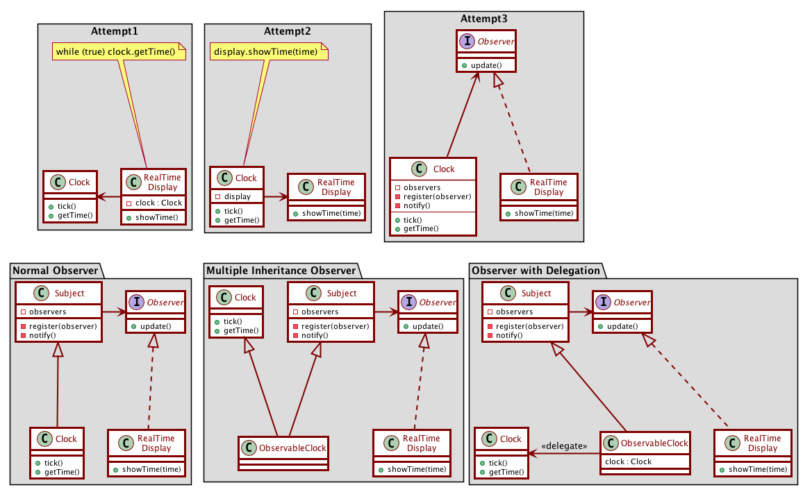

# Activity 16-1: Observer Pattern

Video segments from: [Observer Pattern](https://learning.oreilly.com/videos/clean-code/9780134661742/9780134661742-CODE_E31)

## Clock object and the observer pattern

The observer pattern is used when you have an object that can change for various reasons and you want to be notified of those changes.

- 13:21-14:40 the clock object
- 14:40-16:05 the problem with the infinite loop implementation
- 16:05-16:50 the problem with the second solution, SRP violations
- 16:50-18:00 using dependency inversion to break the dependency: the clock observer
- 18:00-20:40 adding register scheme to clock, another SRP violation
- 20:40-23:00 Extracting the subject superclass, dependencies remain
- 23:00-25:20 The ObservableClock solution, multiple inheritance
- 25:20-26:40 Using delegation to make it work



- 26:40-36:13  rant about multiple inheritance (skip)

## Push vs Pull models

- 36:13-39:40 The pull model
- 39:40-41:40 The "passive" cause-effect relationship

In the pull model:

- The RealTimeDisplay asks the Clock for its new state.
- The Subject and Observer don't need to know anything about this state.
- Therefore the same Subject and Observer classes are reusable across all observer pattern uses.

Pull Model:
```java
public class Subject {
    private List<Observer> observers = new ArrayList<>();

    public void register(Observer o) { observers.add(o); }
    public void remove(Observer o) { observers.remove(o); }
    public void clear() { observers = new ArrayList<>(); }
    public void notifyObservers() {
        for (Observers o : observers) { o.update(); }
    }
}
interface Observer {
    public void update();
}
```

- 41:40-42:40 The problem with the pull model

## The push model:

- 42:40-44:20 Passing a hint with update
- 44:20-45:10 Using generics

The observed object passes data up to the observer.

Push Model with generics:
```java
public class Subject<T> {
    private List<Observer<T>> observers = new ArrayList<>();

    public void register(Observer<T> o) { observers.add(o); }
    public void remove(Observer<T> o) { observers.remove(o); }
    public void clear() { observers = new ArrayList<>(); }
    public void notifyObservers(T pushedData) {
        for (Observers<T> o : observers) { o.update(pushedData); }
    }
}
interface Observer<T> {
    public void update(T data);
}
```

- 45:10-47:16 Choosing between observer models

Factors: Complexity of data, and timing of data.

- With complex data, push model allows you to pass information about what has changed, instead of having the observers figure it out by comparing the new object state with the old state.
- The data passed via the push model might be out of date by the time it is examined.

## Case study: chat application

Let's imagine a chat application. We would likely have a `Chat` class that represents a chat object. The chat maintains a series of `ChatEvent`s (for example an event for a user posting a message, or an event for a user joining or leaving the chat).

We also have `ChatClient` components, representing a user listening in on the chat. This could be an actual user, or possibly a logging software.

`ChatClient`s need to be notified when the `Chat` object they are participating in has an update.

The observer model is a perfect setup for this. The `Chat` class would extend a `Subject` class, and `ChatClient` would implement `Observer`.

- Pull model: When new chat activity happens, the chat class notifies the observers that something has changed. The observers then ask the chat class for its state, and read from it any new messages that have come in. Disadvantage: The observers must sort through the current chat state and compare it to what the previous state was, to see what changed.
- Push model: When new chat activity happens, the chat class notifies the observers and passing along this new "event" object. The observers don't need to ask the chat class for news. Disadvantage: There might be new messages that have come to the chat in the meantime, which the observer won't find out about until later.

