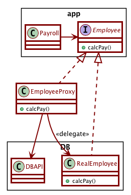
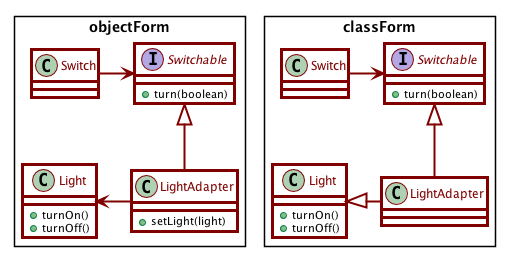

# Activity 16-2: Adapter, Bridge and Proxy Patterns

## Proxy

Video segment from: [Pile'o'patterns](https://learning.oreilly.com/videos/design-patterns-clean/9780135485965/9780135485965-DPCC_E32)

- 44:00-46:50 The proxy pattern: Basic example
- 46:50-52:50 The proxy pattern and the database

Proxy pattern allows two objects to communicate along a communications boundary, without knowing that the boundary exists.

## Adapter

The adapter pattern allows us to connect a client to a service without the two knowing about each other.

- 66:20-73:00 The button-light problem
- 73:00-75:00 The adapter pattern (object form)
- 75:00-78:00 The adapter pattern (class form)

## Bridge

Video segment from: [Pattern apocalypse](https://learning.oreilly.com/videos/clean-code/9780134661742/9780134661742-CODE_E34)

Bridge pattern is useful when a set of objects can be expressed via multiple inheritance hierarchies.

Example: Employees have different payment schedules and different payment classifications.

The Bridge pattern is essentially a "bunch of strategies".

- 10:10-13:40 Motivation for the Bridge pattern: The m times n problem
- 13:40-23:30 The Bridge pattern

As time permits:

- 24:00-26:40 Motivation for chain of responsibility pattern
- 26:40-35:00 Chain of responsibility pattern
