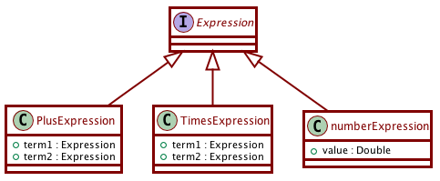

# Activity 17-2: Visitor Pattern

Video segments from: [SMC Generator](https://learning.oreilly.com/videos/clean-code/9780134661742/9780134661742-CODE_E30)

## The visitor pattern

The visitor pattern is useful when we want a behavior in a hierarchy, but we don't want to add methods to the hierarchy in order to achieve the behavior.

Example: Imagine an `Expression` superclass/interface that presents arithmetic expressions. It has subclasses like `PlusExpression`, `TimesExpression`, `NumberExpression`. For example the expression 4 + 5 would be presented as a `PlusExpression` object, whose `term1` entry would be a `NumberExpression` object containing the value 4, and its `term2` entry would be a `NumberExpression` object containing the value 5.



We want to do numerous operations on objects of type `Expression`:

- Compute the sum
- Count the number of additions
- Count the number of negative values
- Change every addition to a multiplication etc

But we do NOT want to keep adding new methods to the `Expression` interface every time we come up with a new idea. So we need to have some other class for each of these responsibilities, and that other class needs to somehow traverse the expression hierarchy. The fancy way of saying this is that we can "add polymorphic behaviors to an existing hierarchy without changing the hierarchy".

Solution 1 (type checks and typecasts):
```java
class Calculator {
    double calculate(Expression e) {
        if (e instanceof NumberExpression) {
            return ((NumberExpression) e).value;
        } else if (e instanceof PlusExpression) {
            PlusExpression ePlus = (PlusExpression) e;
            return calculate(ePlus.term1) + calculate(ePlus.term2);
        } else if (e instanceof TimesExpression) {
            ...
        }
    }
}
```

Problems with this approach:

- We keep repeating the conditional logic each time.
- A lot of typechecks and typecasts.
- It is not "object-oriented"

Solution 2 (observer, part 1):
```java
class NumberExpression {
    ...
    void accept(Visitor v) { v.visitNumber(this); }
}
class PlusExpression {
    ...
    void accept(Visitor v) { v.visitPlus(this); }
}
...
interface Visitor {
    void visitNumber(NumberExpression e);
    void visitPlus(PlusExpression e);
    void visitTimes(PlusExpression e);
}
class Calculator implements Visitor {
    void visitNumber(NumberExpression e) {
        return e.value;
    }
    void visitPlus(PlusExpression e) {
        return e.term1.accept(this) + e.term2.accept(this);
    }
    void visitTimes(TimesExpression e) {
        return e.term1.accept(this) + e.term2.accept(this);
    }
}
```

Timings:

- 52:22-62:00 The visitor pattern
- 62:00-63:00 Adding a new derivative to the modem hierarchy
- 63:00- Another 90 degree rotation  (skip)

