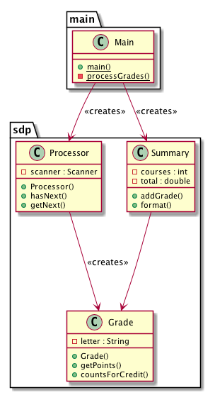
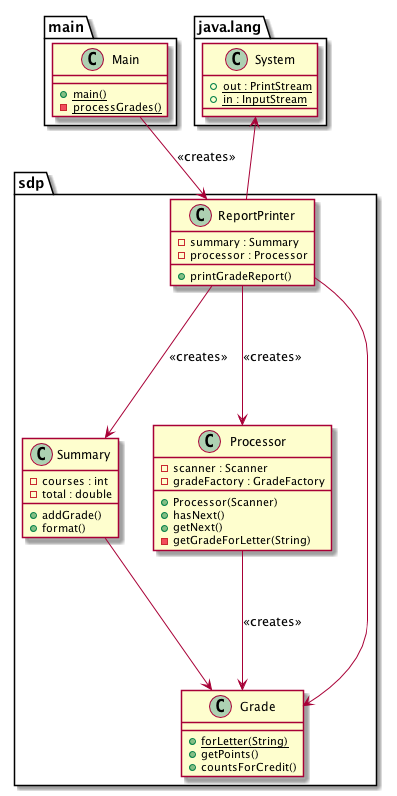
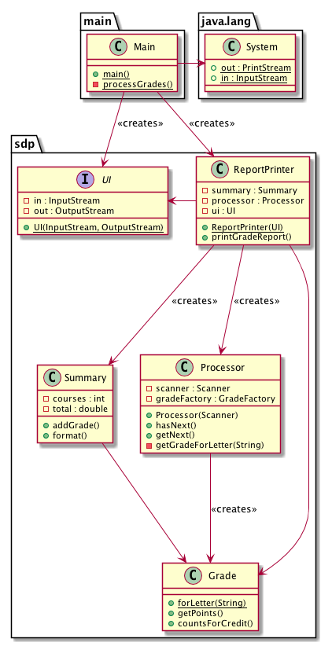

# Activity 6-3: Introduction to the SOLID principles

Interjecting segments of the [SOLID principles video](../videos/09-solid_principles.md) (only available in class or by purchase).

## Overview

- 00:50-04:45 overview of previous video

1. A system's architecture is based on its ...
2. How do we separate databases and graphical interfaces from the core application?
3. How do we manage the dependencies on the system boundaries?
4. Details should depend on ...
5. A good architecture maximizes ...

TODO: Add visual example

## Design vs Building

11:15-20:05 the source code is the design

1. What is the design document produced by engineers? What is the product?
2. In what way do the costs of design and building differ in software engineering vs other engineering fields?

## Design Smells

**20:05-30:35 design smells**: ridigity, fragility, immobility, viscosity, needless complexity

1. What are examples of rigidity in a system?
2. What are examples of fragility in a system?
3. What is another name for fragility?
4. What are examples of immobility?
5. What are examples of viscosity?
6. What is the main cause of unnecessary complexity?

## Code Rots

30:35-37:30 examples of code rot

1. What is the problem with the code presented in the video? In what way is it going to get worse over time?

**37:30-39:19** how to prevent the code from rotting

1. What is the mechanism that allows this version to read from multiple sources?

## Dependency Inversion and OO

39:15-43:35 dependency inversion

1. How does dependency inversion prevent the code from rotting?

This is the initial version of our grading app in diagram form.

Let us change the code a little bit. Instead of having `Main` do some of the work in its `processGrades` method, we want `Main` to simply create a `ReportPrinter` object, which will then create a `Processor` class instance and a `Summary` class instance, and it is then uses the processor to process grades and add them to a summary, then finally print out the summary. The diagram might look as follows:

As it stands, we cannot really change where the input is coming from and where the output is going to. In order to do that, we would need to change our `ReportPrinter` class. But imagine we have a `UI` class, which contains a pair of input and output streams. Then `Main` could pass this pair to the `ReportPrinter` as an argument, then the reportPrinter can use the streams there instead of relying on standard input and output. This is how it would look like in diagram form:

We can now freely change the UI for a `ReportPrinter` by changing the parameter we pass to the `ReportPrinter`.

**Question**: Can we use this system in a situation where our data entries are stored in some HTML file? What design change do we need to make to allow that to happen?

What if we want to be able to "print" the report in various forms, e.g. in Excel, or to a graphical interface, or in speech form?

43:35-46:45 the truth about OO

1. What is the significance of the notation `o.f(x)`, compared to `f(o, x)`? How should we be interpreting it?

46:45-48:48 dependency management

1. What are the SOLID principles about?

48:48-51:23 summary
