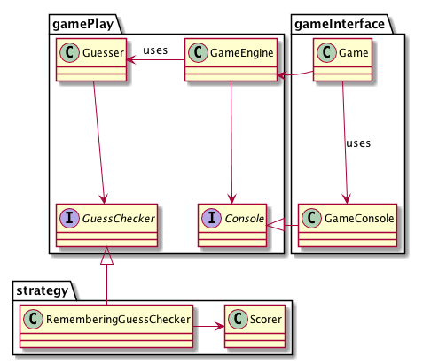

# Activity 6-5: Practice on the Mastermind code

We will spend some time looking around at the completed code for the Mastermind game. Recall the diagram describing the structure of the code.

## Load the code in IntelliJ

1. Go to our Moodle class page, and download the **Mastermind Code** zip file.
2. Extract the contents of the zip file into the directory where you save your CS321 projects. The zip file contains a `MasterMind` folder in it, so you don't need to create any special folders.
3. Start IntelliJ, and use the "File -> New Project from Sources" option to start a new project based on the `MasterMind` folder that you just extracted.
4. Once the project is open, navigate into one of the test classes, and use the "Add JUnit 4 to classpath" intention on any of the red "junit" references in the imports section of the test.
5. Run all the tests by right-clicking on the green `test` directory and choosing "Run all tests", make sure your tests pass.
6. Find and run the `Game` class' `main` method in the `src` directory, and play the game once, to make sure it all works.

## Questions to answer

0. Are the classes and interfaces separated in modules according to the diagram?
1. Identify which parts/lines of the code establish each of the arrows we have in the diagram, namely:

    - Arrow from `Game` to `GameConsole`
    - Arrow from `Game` to `GameEngine`
    - Arrow from `GameConsole` to `Console`
    - Arrow from `GameEngine` to `Console`
    - Arrow from `GameEngine` to `Guesser`
    - Arrow from `Guesser` to `GuessChecker`
    - Arrow from `RememberingGuessChecker` to `GuessChecker`
    - Arrow from `Scorer` to `RememberingGuessChecker`

2. What are the methods specified in the `Console` interface? What method is missing from there that we would have expected?
3. What are the private methods of the `GameConsole` class, and what do they do?
4. If we want to move the `GameConsole` class to the upper level, what prevents us from doing that? How can we fix it?
5. What are the methods specified in the `GuessChecker` interface? What do they do? Are their names appropriate?
6. How does the `RememberingGuessChecker` implement the methods in the `GuessChecker` interface?
7. When are new instances of the `Scorer` class created?
8. If we want to change the set of letters that the game is based on, which files would that affect?
9. How is the `Guesser` generating new guesses?
10. The `Score` and `ScoreRecord` classes are not in our diagram yet.
  - Why do you think they were omitted?
  - Where would they be added in the diagram?
  - What arrows/relationships will they have with the other parts of the diagram?
