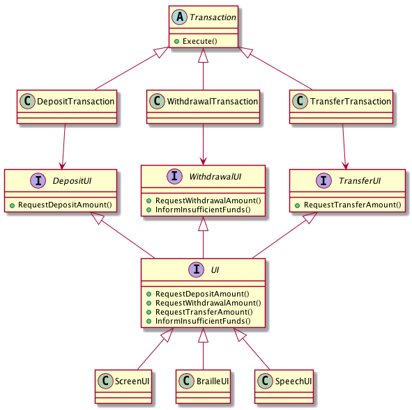

# Activity 7-3: The Interface Segregation Principle

## Introduction

**03:24-06:50    overview**

## Interfaces

**14:28-21:00    interfaces**

1. What is the problem with the `Switch -> Light` dependency?
2. What do interfaces have more in common with? Their users *or* their clients?
3. Explain the terms **physical coupling** and **logical coupling** and the phrase "Inheritance is the strongest of the physical couplings but the weakest of the logical couplings".
4. How should we *name* interfaces?

## Fat classes

**24:40-33:42  fat classes example: the job class**

**33:42-36:30 the problem with fat classes**

1. Fat classes have large fan-____
2. Fat classes can be protected from their clients by creating a separate interface for each client.

Consider the following example from an ATM application.

Each of the different transactions uses different parts of the interface. However as it stands they all depend on the interface.

Question: If the TransferTransaction needs a new method added to the interface, which parts of the system will need to be recompiled?

**Conclusion**: A module that knows about more than it needs to may end up being affected by changes to other modules that it does *not* depend on, because those modules may ask for changes to other modules that they both depend on.

*Common dependencies cause transitive coupling between the modules that share the dependency*.

Alternative setup, solves this problem.

## The Interface Segregation Principle

**45:00- 50:00 the interface segregation principle**

1. What does the interface segregation principle say?

**54:00-58:25 the need to know**
