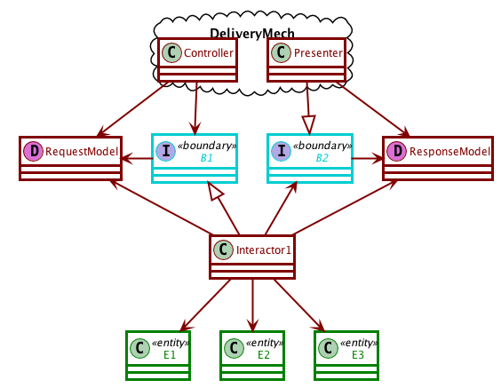
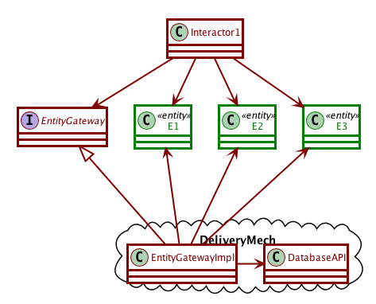

# Activity 9-1 Use-case architectures

Following along with [video 7: Architecture](../videos/17-architecture.md)

- The architecture of a system should be based on its *use cases*.
- A **use case** is a formal description of the way a user interacts with the system in order to achieve a certain goal, phrased in a delivery-independent way.
- Architecture allows you to defer decisions (like databases and GUIs).

**31:32-40:20 use cases**

**40:20-46:12 partitioning**

## Components of use-case architectures

Use case architecture is composed of 3 kinds of objects:

Entities
  ~ are "business objects". They carry application-independent business rules about the elements of our system. Its methods should be useful to *all* applications that might need this kind of object, but no methods that are specific to the application.

Interactors
  ~ are "use case objects". They carry all the application-dependent business rules, and their methods are specific to the application we are working on.

Boundaries
  ~ are "user interface objects". They separate the use cases from the delivery mechanism and provide a communications pathway between the two sides.

Methods in the interactors implement their tasks by calling application-independent methods in the entities and manipulating entities according to their use case.

## Interacting with the user

1. The delivery mechanism prepares a request from the user in a canonical form,
2. passes it through the boundary to the interactor,
3. which invoke the application-specific business rules and manipulate the entity objects,
4. then compute the result and wrap it into a result model, which is then passed back to the delivery mechanism via another boundary object.

## Model/View and use cases

**46:12-52:45 isolation**

## Interacting with the database

**52:45-57:12 database**

