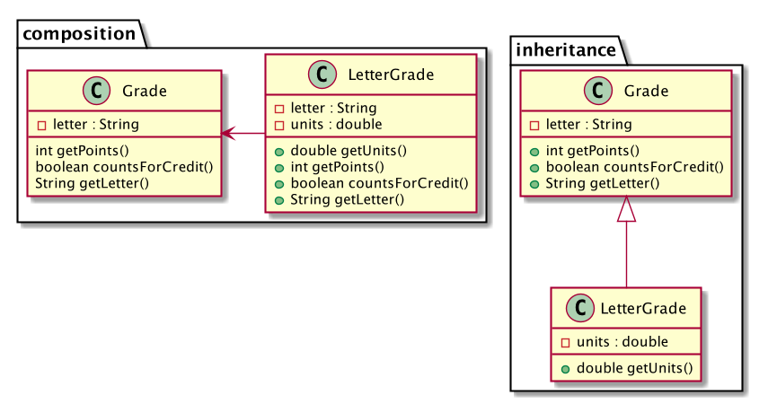

# Object-Oriented-Programming Extension mechanisms

## Relationships between classes and objects

Classes and objects on their own are not too hard to understand. The challenge starts when classes and objects interact with each other.

First of all, let's discuss how object objects learn about each other:

- The object may directly call the constructor of the other object's class and create this object. For instance a class implementing a stack may create an array to hold the stack elements.
- They may be given an object during their construction, as arguments to their constructor.
- They may be given an object during a method call, as arguments to that method.
- They may obtain an object by calling a method of another object they already know about.

Of these four methods the first one stand out, as it creates a very tight coupling: *The creator object knows exactly what class the created object is*. In all the other cases the only information communicated is the *interface* of the object.

## Extension Mechanisms

There are numerous mechanisms that allow us to **extend** the functionality provided by a certain class. The main two mechanisms are the following:

- **class inheritance**, in which we extend the functionality offered by a class by creating a subclass of it. This is often described as an *is-a* relationship.
- **object composition**, in which we use objects of other classes via fields in our new class. This is often described as a *has-a* relationship.

Example. Consider a simple `Grade` class:
```java
class Grade {
    private final String letter;

    public Grade(String letter) {
        throwExceptionIfInvalidLetter();
        this.letter = letter;
    }

    public int getPoints() { ... }
    public boolean countsForCredit() { ... }
    public String getLetter() { return letter; }
}
```
We now want to create a `UnitGrade` class. It needs to allow for both a letter grade and also the amount of units that the class is worth (1, 0.5 etc). We have fundamentally two options for the design of this new class:

1. The *inheritance* approach says that we should create a new *subclass* of the `Grade` class which also contains a new field, for the units:

    ```java
    class UnitGrade extends Grade {
        private final double units;

        public UnitGrade(String letter, double units) {
            super(letter);   // Call Grade constructor
            this.units = units;
        }

        public double getUnits() { return units; }
        // countsForCredit is inherited
        // getLetter is inherited
        public int getPoints() {
            return units * super.getPoints();
        }
    }
    ```

    We use the term `extends Grade` to indicate that this is a subclass of `Grade`, and will therefore inherit everything that `Grade` has. In this instance we automatically get for free the `countsForCredit` and `getLetter` methods. We have to modify the implementation of `getPoints` because it has to take into account the `units`. We can use the `super` keyword whenever we have to refer to the superclass.
2. The *composition* approach says that we should create a new class that has a `grade` field in it and a `units` field in it.

    ```java
    class UnitGrade {
        private Grade grade;
        private double units;

        public UnitGrade(String letter, double units) {
            this.grade = new Grade(letter);
            this.units = units;
        }
        // other possible constructor, receiving an external grade
        public UnitGrade(Grade grade, double units) {
            this.grade = grade;
            this.units = units;
        }

        // Delegations
        public boolean countsForCredit() { return grade.countsForCredit(); }
        public String getLetter() { return grade.getLetter(); }

        public getUnits() {
            return units * grade.getUnits();
        }
    }
    ```

    In this case a `UnitGrade` instance contains a `Grade` instance as a field, and it can refer to it for information. In particular, some of the methods of `UnitGrade` simply return a corresponding call to `grade`. This is called **delegation**.

Let's discuss advantages and disadvantages of the two approaches:

- Inheritance is a bit easier to understand, and requires less code to implement. Composition on the other hand requires more work, via delegation for example.
- Inheritance fixes the implementation of Grade at compile-time. If we wanted to instead use a subclass of the `Grade` class (maybe some specialized "pass/fail grade subclass", we cannot do that. In other words, *inheritance directly links the two classes*. On the other hand with composition, the field `grade` can belong to any subclass of `Grade`. *Composition allows the specific class that is used to be determined at runtime, and to even change in the lifetime of an application.*

Essentially, *inheritance is a static compile-time source-code dependency between **classes**, while composition is a dynamic run-time dependency between **objects**.*

In UML notation, these two dependencies are drawn differently: inheritance is a hollow-point arrow, often drawn in a consistent vertical direction, while composition is a filled-point arrow, often drawn in a horizontal direction.



## Example

- Java's [Reader](https://docs.oracle.com/javase/8/docs/api/java/io/Reader.html) class provides an interface for reading from character input streams. It has methods like `read()`, `ready()`, `skip(n)`, `close()`. It is actually an *abstract class*, with a number of implementations. So for this discussion you should  think of it more of as an interface.
- [CharArrayReader](https://docs.oracle.com/javase/8/docs/api/java/io/CharArrayReader.html) is a concrete subclass of `Reader` which reads its contents from a provided character array. It is anexample of *inheritance*, as it inherits some functionality from the abstract class.
- [InputStreamReader](https://docs.oracle.com/javase/7/docs/api/java/io/InputStreamReader.html) is another concrete subclass of `Reader` that reads its input from an "input stream" (like the terminal standard input). It is also an example of *inheritance*. In order to do its work, it takes as argument to its constructor an `InputStream`. It is therefore an example of *composition* as well.
- [BufferedReader](https://docs.oracle.com/javase/8/docs/api/java/io/BufferedReader.html) is a subclass of `Reader`. It takes in as input another object `in` of type `Reader`, and "buffers" the read input by reading it in specified chunks. It is therefore an example of *composition*. At the same time, it is also an example of *inheritance*, as it inherits some functionality from `Reader` via the subclass relationship. This is an example of a **decorator**: It both inherits from the `Reader` class as well as composes from it: It effectively acts as a "decoration" to the existing behavior of some other Reader, rather than directly providing the Reader behavior itself.
- [LineNumberReader](https://docs.oracle.com/javase/8/docs/api/java/io/LineNumberReader.html) is a subclass of `BufferedReader` which further keeps track of line numbers. This is an example of *inheritance*.

**PRACTICE**: Draw a UML diagram containing all these classes and their relationships.
